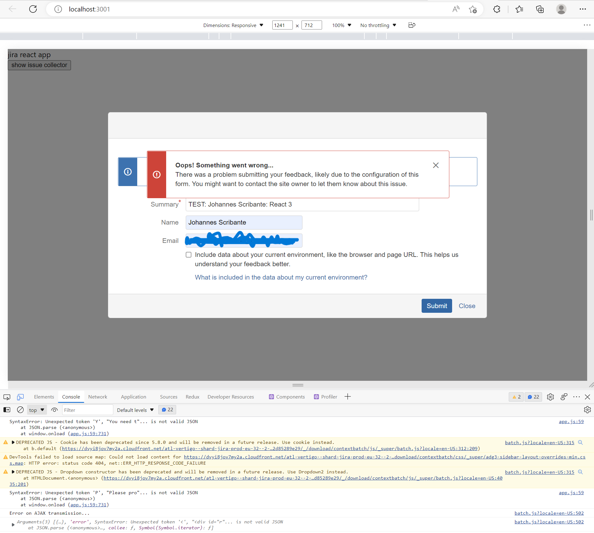

# React and Jira Issue Collector

This code sample highlights a form submission difference between a Jira Issue
Collector implementation embedding the issue collector in a generic HTML page
and embedding the issue collector in a Create React App.

# Generic HTML Example

A simple generic HTML implementation located at `./generic-html/index.html`. 

**Note**: The generic example works as expected. The HTML script tags are
included in the head of the file. With a button to trigger the form rendered
to the screen. When the button is clicked, the form modal is rendered to the
screen. The form can be filled in, and when the `Submit` button is clicked, 
the form submission is successful.

# React Example

A very simple React app is created, with all the components within the `App.tsx`
file. The script tags for the issue collector are in the `head` of the 
`./public/index.html` the same as with the generic HTML example.

With the button implementation similar to that of the generic HTML, in a more
React idiomatic way of calling click event handlers.

### Install and start app

```bash
npm install
# then
npm start
```

## Behaviour

Steps:
1. Install and start the app.
2. When the app has started go to the [home page](http://localhost:3000)
3. Click on the button `show issue collector`. This will bring up the Jira issue collector.
    1. Fill in the form.
    2. Submit the form.
    3. **Note:** The form will report and error.


After the submit button has been clicked.



Error object reported in console.

```json
{
    "0": {
        "aborted": 0,
        "responseText": "<div id=\"root\"><div id=\"seven-json-viewer\"> <div class=\"app-container\"><div class=\"app-content\"><div class=\"json-view\"><section class=\"block \"><button class=\"button button-white block--content__left \"><svg stroke=\"currentColor\" fill=\"currentColor\" stroke-width=\"0\" viewBox=\"0 0 24 24\" height=\"1em\" width=\"1em\" xmlns=\"http://www.w3.org/2000/svg\"><path d=\"M8 5v14l11-7z\"></path></svg></button><section><span class=\"bracket\">{</span><span class=\"bracket\">}</span></section></section></div></div><div class=\"app-toolbar\"><input class=\"json-path-input\" placeholder=\"$.theater[*].movies\" type=\"text\" value=\"\"></div></div></div></div><div id=\"snackbar\"></div>",
        "responseXML": null,
        "status": 0,
        "statusText": "n/a",
        "error": {
            "message":  `Unexpected token '<', "<div id="r"... is not valid JSON`,
            "stack": `SyntaxError: Unexpected token '<', "<div id="r"... is not valid JSON\n    at JSON.parse (<anonymous>)\n    at parseJSON (https://d2owm1y91w1zxj.cloudfront.net/atl-vertigo--shard-jira-prod-eu-27--3--jres.atlassian.net/s/collector-resource-d41d8cd98f00b204e9800998ecf8427e-CDN/1jmxwi/b/8/64b53e58c620362cef53692d85289e29/_/download/contextbatch/js/_super/batch.js?locale=en-US:284:10575)\n    at HTMLIFrameElement.g (https://d2owm1y91w1zxj.cloudfront.net/atl-vertigo--shard-jira-prod-eu-27--3--jres.atlassian.net/s/collector-resource-d41d8cd98f00b204e9800998ecf8427e-CDN/1jmxwi/b/8/64b53e58c620362cef53692d85289e29/_/download/contextbatch/js/_super/batch.js?locale=en-US:1416:311)`
        }
    },
    "1": "error",
    "2": {
        "message": `Unexpected token '<', "<div id="r"... is not valid JSON`,
        "stack": `SyntaxError: Unexpected token '<', "<div id="r"... is not valid JSON\n    at JSON.parse (<anonymous>)\n    at parseJSON (https://d2owm1y91w1zxj.cloudfront.net/atl-vertigo--shard-jira-prod-eu-27--3--jres.atlassian.net/s/collector-resource-d41d8cd98f00b204e9800998ecf8427e-CDN/1jmxwi/b/8/64b53e58c620362cef53692d85289e29/_/download/contextbatch/js/_super/batch.js?locale=en-US:284:10575)\n    at HTMLIFrameElement.g (https://d2owm1y91w1zxj.cloudfront.net/atl-vertigo--shard-jira-prod-eu-27--3--jres.atlassian.net/s/collector-resource-d41d8cd98f00b204e9800998ecf8427e-CDN/1jmxwi/b/8/64b53e58c620362cef53692d85289e29/_/download/contextbatch/js/_super/batch.js?locale=en-US:1416:311)`
    }
}
```


